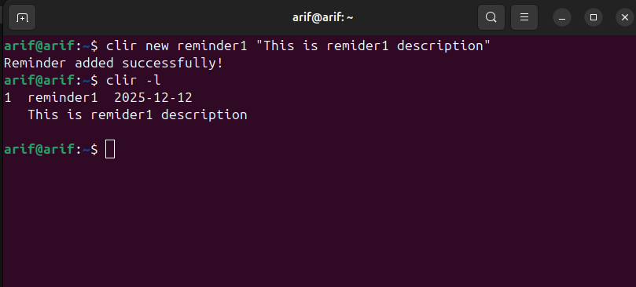
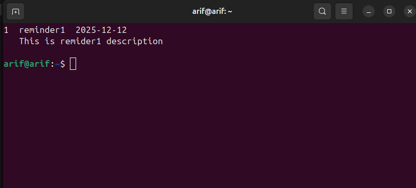

# CLI Reminder (clir)

A simple command-line interface (CLI) reminder application written in C++ using SQLite.  
It allows you to create, list, and delete reminders easily from your terminal.

---

## Features

- Add new reminders with title and description.
- List all active reminders.
- Remove reminders by ID.
- Lightweight and fast.
- Works on Linux/macOS (requires SQLite3).

---

## Installation

### 1. Clone the repository
```bash
git clone https://github.com/Afko98/clir.git
cd clir
make
```
This will generate `clir` executable in `./build`

### 2. Auto-list reminders on new terminal open (Optionaly)
```bash
sudo mv clir /usr/local/bin
echo 'clir -l' >> ~/.bashrc
source ~/.bashrc
```

### Example [Adding new reminder]



### Example Output [On new terminal open]

